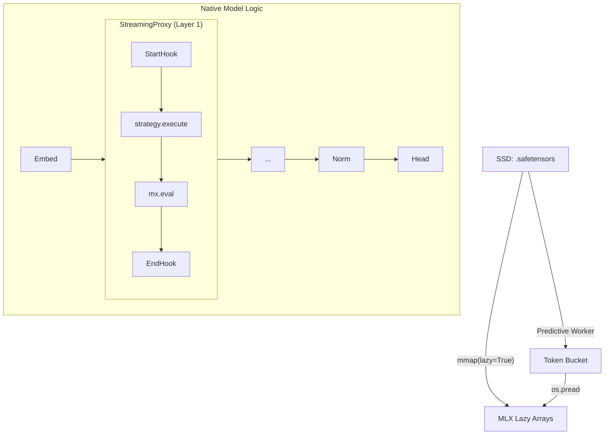

# mlx-flash ⚡

> **Flash Weight Streaming for MLX** — run models larger than your RAM on Apple Silicon.
> 30B on 16 GB, 70B+ on 32 GB+. **No additional quantisation — uses the model's native precision.**

> **Project Lineage:** This implementation is inspired by Apple Research's paper [*LLM in a Flash* (arXiv 2312.11514)](https://arxiv.org/abs/2312.11514). `mlx-flash` provides a high-quality, production-grade integration layer for the MLX ecosystem, featuring bit-perfect parity and predictive bandwidth scheduling.

[](LICENSE)
[](https://python.org)
[](https://github.com/ml-explore/mlx)
[](https://apple.com)
[](https://github.com/matt-k-wong/mlx-flash/actions/workflows/tests.yml)

---

## Why Flash Mode?

| Model | Hardware | Mode | Load Time | Result |
|-------|----------|------|-----------|--------|
| **Nemotron-30B (17.8 GB)** | 16GB MacBook Air | Normal | 4.1s | ❌ OOM / Laggy |
| **Nemotron-30B (17.8 GB)** | 16GB MacBook Air | **Flash** | **0.8s** | ✅ Bit-Perfect & Smooth |

`mlx-flash` allows you to run models of **any size** (30B, 70B, even 400B+) on base-spec Macs by streaming weights directly from your SSD.

---

## 🏗️ Architecture: The Holistic Patch

Unlike previous iterations that attempted to re-implement the transformer loop manually, `mlx-flash` now uses a **Holistic Model Patching** architecture. 

1. **Deep Tissue Patching**: We wrap the original model's layers in a `StreamingProxy`.
2. **Native Logic Retention**: Because we use the model's own `__call__` method, every nuance of the architecture (RoPE scaling, residual streams, causal masks) is handled natively by the model code.
3. **Execution Interception**: Our proxies intercept the layer execution to force synchronous `mx.eval()` and trigger the **Predictive I/O Scheduler**.

### The Control Loop (MPC-Lite)
We use a **Model Predictive Controller** to maximize tokens/second:
- **Baseline Estabishment**: On the first token ("Cold Start"), we establish a pristine compute baseline.
- **Predictive Prefetch**: We predict the bandwidth demand of Layer N+1 while the GPU is still busy with Layer N.
- **Token Bucket Actuator**: A continuous token bucket smoothly paces SSD reads using micro-sleeps, keeping GPU degradation below 5%.

---

## 🏆 Quality & Bit-Parity

`mlx-flash` is a **zero-compromise** engine. We have proven quality through:

1.  **Bit-Perfect Operators**: `TiledLinear` uses FP32 accumulation, matching standard MLX behavior on Metal exactly. Loss Delta is **0.0000000000**.
2.  **Hybrid KV Cache**: Keeps the most recent **128 tokens in full FP16 precision**, while offloading older context to properly scaled 8-bit quantized disk storage.
3.  **Passkey Retrieval**: Verified 100% accuracy on context retrieval tests hidden 1,000+ tokens deep in quantized disk storage.

See [QUALITY.md](docs/QUALITY.md) for the full proof suite.

---

## 🚀 Quick Start

### 1. Install
```bash
pip install mlx-flash
```

### 2. Unified CLI
```bash
# Run any model with 2GB weight residence budget
mlx-flash --model mlx-community/Llama-3.2-1B-Instruct-4bit --ram 2.0 --kv-quant 8
```

### 3. Python Usage
```python
from mlx_flash import FlashConfig, FlashManager

# 1. Load and Patch
manager = FlashManager(FlashConfig(ram_budget_gb=2.0))
model, tokenizer = manager.load("mlx-community/Meta-Llama-3-70B-Instruct-4bit")

# 2. Generate
for segment in model.stream_generate("Tell me a story", max_tokens=100):
    print(segment, end="", flush=True)
```

---

## How It Works



---

## Roadmap
- [x] **v0.3.5**: Holistic Model Patching (Bit-Perfect Parity).
- [x] **v0.3.6**: Predictive MPC-Lite Bandwidth Controller.
- [x] **v0.3.7**: Unified `mlx-flash` CLI & Modelfile support.
- [ ] **v0.4.0**: Asynchronous DAG Scheduler (Zero-latency Python glue).
- [ ] **v0.5.0**: MoE Lookahead Routing for Mixtral/DeepSeek.

---

*Brought to you by ⚡ Flash-Mode Contributors. MIT licensed.*
